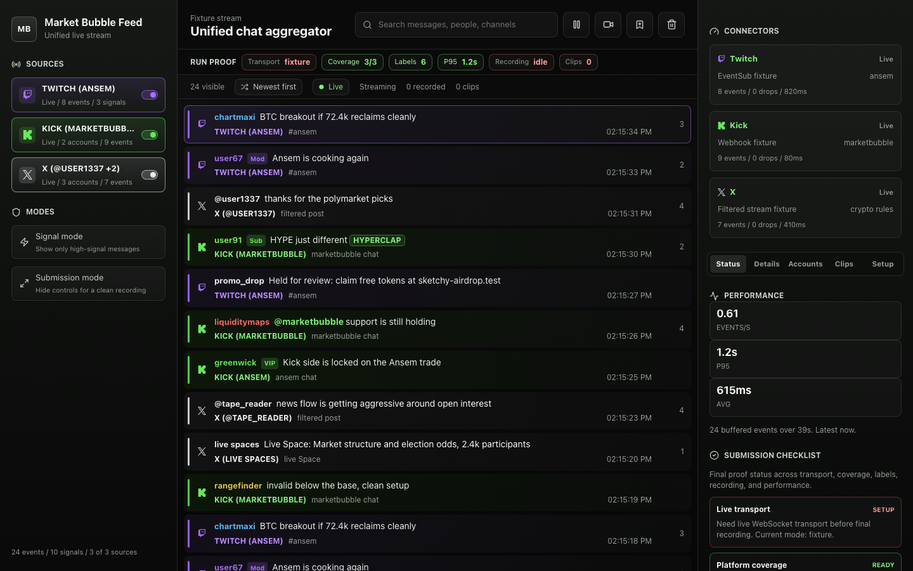
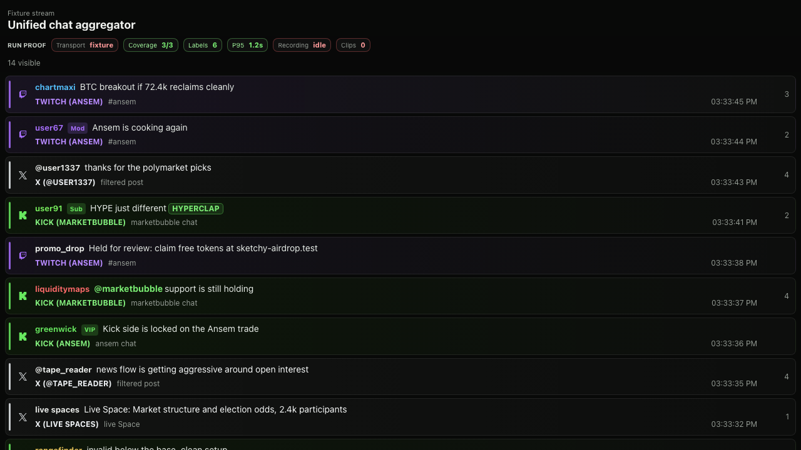

# User Guide

Everything you need to run the Market Bubble Feed: what each part of the screen does, how to go live with real chat, and how to put the feed on stream with OBS.



## What this app does

It merges Twitch chat, Kick chat, and X posts into one live feed. Every message keeps its platform logo, its platform color, and an account label such as `TWITCH (ANSEM)` or `KICK (MARKETBUBBLE)`, so you always know where a message came from. You can search, filter, clip the best moments, record the session, and overlay the feed on a stream through OBS.

## Start it in 60 seconds

Before anything else you need two tools installed:

- [Node.js](https://nodejs.org) version 20.19 or newer. Installing Node also installs `npm`. Check with `node -v`.
- [Git](https://git-scm.com), to download the project. Check with `git --version`.

Then open a terminal and run these four commands, one at a time:

```bash
git clone https://github.com/ramenxbt/unified-chat-aggregator.git
cd unified-chat-aggregator
npm install
npm run dev
```

What each one does: `git clone` downloads the project to your computer, `cd` moves into the project folder, `npm install` downloads the dependencies (one-time, takes a minute), and `npm run dev` starts the app.

When the terminal prints a local address, open `http://127.0.0.1:5173/` in your browser. The app starts in demo mode with realistic sample messages, so every feature below works immediately with no accounts and no credentials. To stop the app, press `Ctrl+C` in the terminal. Next time, you only need `npm run dev`.

## The screen, piece by piece

The dashboard has three areas: sources on the left, the feed in the middle, and tools on the right.

### Left side: sources and modes

- **Twitch / Kick / X toggles**: click to hide or show that platform in the feed. The switch shows on or off, and each card shows live event counts.
- **Signal mode**: shows only high-signal messages (mentions, emote bursts, active authors) and hides ordinary chatter.
- The line at the bottom shows totals: events, signals, and active sources.

### Middle: the feed

- Newest messages arrive at the top. Each row shows the platform logo, the author, badges like Mod or VIP, the message, the account label, and the time.
- The colored bar on the left edge of each row is the platform: purple is Twitch, green is Kick, white is X.
- **Search** matches message text, author names, account names, platforms, and event types. Matches highlight in gold.
- **Pause / Resume** freezes the feed while you read. **Record** starts capturing events. **Clip** bookmarks the selected message. **Clear** empties the feed.
- Under the title sits the **Run proof strip**: transport state, platform coverage, label count, latency, recording count, and clip count. It stays visible in every view so a recording always shows the run is real.
- Scroll down in the feed and the `Live` pill becomes `Jump live`; click it to snap back to the newest messages. `Newest first` flips the order for chronological review.

### Right side: connectors and the five tabs

The connector cards at the top always show each platform's state, mode, account, event count, drops, and latency.

Below them, five tabs:

- **Status**: performance numbers (events per second, p95 latency, average latency) and the submission checklist that tracks transport, coverage, labels, recording, and performance proof. The review queue lists held, deleted, or spam-risk messages.
- **Details**: opens automatically when you click any message. Shows the author profile, badge stack, event counts, raw platform IDs, and two filter buttons to focus the feed on that author or that source account.
- **Accounts**: every active source account with one-click filters, plus identities that group the same account name across platforms, such as `TWITCH (ANSEM)` and `KICK (ANSEM)`.
- **Clips**: the clip queue, saved sessions, and every import/export action.
- **Setup**: live-readiness for each platform with the exact env values still missing, plus ready-to-open OBS preset links.

## Everyday actions

**Clip a great message.** Click the message, then click `Clip` in the top bar. It gets a gold border and a CLIP tag, joins the clip queue, survives a page reload, and counts in the proof strip. Export the queue as JSON from the Clips tab.

**Record a session.** Click `Record`. Every event from that moment (plus the current buffer) is captured. Click `Stop`, then export JSON or CSV from the Clips tab.

**Replay a recording.** Clips tab, `Import recording JSON`, pick an exported file. The app switches to replay mode; the top-left label shows the file name. `Exit replay` returns to the live feed.

**Share a moment.** `Copy replay link` makes a URL that loads the current buffer in replay mode for anyone on the same build.

**Save your buffer.** `Save current buffer` in the Clips tab keeps the session in local storage (latest 12). Load any saved session back as a replay with one click.

## Going live with real chat

Copy the template and fill in only the platforms you need. Any platform without credentials stays in demo mode, so a partial setup still runs.

```bash
cp .env.example .env
```

### Twitch

1. Go to the [Twitch developer console](https://dev.twitch.tv/console) and register an application to get a **Client ID**.
2. Generate a **user access token** with the `user:read:chat` scope (the Twitch CLI or a token generator both work).
3. Find the numeric user IDs for the broadcaster and for the account that owns the token (any "Twitch username to ID" lookup works).

```ini
TWITCH_CLIENT_ID=your_client_id
TWITCH_ACCESS_TOKEN=your_user_token
TWITCH_BROADCASTER_USER_ID=123456
TWITCH_BOT_USER_ID=654321
TWITCH_BROADCASTER_LOGIN=marketbubble
```

### Kick

Kick delivers chat through webhooks, so Kick needs a public URL that reaches your machine.

1. In a separate terminal, start a tunnel to the local receiver:

```bash
cloudflared tunnel --url http://127.0.0.1:8788
# or: ngrok http 8788
```

2. Put the public URL it prints into `.env`, ending in `/webhooks/kick`:

```ini
KICK_WEBHOOK_ENABLED=true
KICK_WEBHOOK_PUBLIC_URL=https://your-tunnel-host/webhooks/kick
KICK_BROADCASTER_SLUG=marketbubble
```

3. In the [Kick developer settings](https://kick.com/settings/developer), point your app's webhook at that same public URL and subscribe to `chat.message.sent`. To let the feed server subscribe automatically on startup, also set `KICK_ACCESS_TOKEN`, `KICK_BROADCASTER_USER_ID`, and `KICK_SUBSCRIBE_ON_START=true`.

### X

1. In the [X developer portal](https://developer.x.com), create a project and copy the **Bearer Token**. Filtered stream access requires a plan tier that includes it.

```ini
X_BEARER_TOKEN=your_bearer_token
X_FILTER_RULES=from:marketbubble,Market Bubble,marketbubble
X_SPACES_QUERY=Market Bubble
```

### Start the live stack

```bash
npm run preflight        # tells you exactly what is still missing
npm run feed             # starts the feed server on ws://127.0.0.1:8787
VITE_FEED_WS_URL=ws://127.0.0.1:8787 npm run dev
```

The top-left label switches from `Fixture stream` to `Live feed server`, the connector cards go live, and the Setup tab clears. The feed server also archives every event to `data/feed-sessions/` and to SQLite, so the session has durable proof even if the browser reloads.

One thing to know: the QA gates (`npm run qa:quick`, `npm run qa:final`) rehearse in demo mode. Run them before filling `.env`, or temporarily rename `.env`, because live credentials switch the rehearsal servers into connector mode.

## Connecting to OBS

The app has a built-in overlay route made for OBS browser sources. It hides every control and uses a transparent page background, so only the chat rows appear over your scene.



### Add the browser source

1. Start the dashboard (`npm run dev`, plus `npm run feed` if you are live).
2. In OBS: **Sources, click +, Browser**. Name it `Unified Chat - All Sources`.
3. Use these settings:

| Setting | Value |
| --- | --- |
| URL | `http://127.0.0.1:5173/?obs=1&sources=twitch,kick,x&limit=14` |
| Width | 1280 |
| Height | 720 |
| FPS | 30 |
| Custom CSS | `body { background: rgba(0, 0, 0, 0); overflow: hidden; }` |
| Shutdown source when not visible | off |
| Refresh browser when scene becomes active | off |

4. Click OK. Chat rows appear over your scene with platform logos and account labels. Resize and place the source like any other overlay.

### Overlay variations

Change the URL parameters to shape the shot:

| Overlay | URL |
| --- | --- |
| All three platforms | `/?obs=1&sources=twitch,kick,x&limit=14` |
| Twitch and Kick only | `/?obs=1&sources=twitch,kick&limit=12` |
| One account focus | `/?obs=1&sources=twitch&limit=8&q=ansem` |
| High-signal only | `/?obs=1&signal=1&limit=10` |

- `sources` picks platforms, `q` pre-fills the search, `signal` shows only high-signal messages, and `limit` caps visible rows.
- The same links are ready to copy in the dashboard's **Setup tab** under OBS presets.
- To generate a full OBS setup file with every preset and these exact settings, run `npm run obs:handoff -- --out qa/obs` and open `qa/obs/obs-browser-sources.md`.

## Troubleshooting

| Problem | Fix |
| --- | --- |
| Feed shows no messages | Check the source toggles are on and the search box is empty. The empty state says exactly which one to fix. |
| Top-left says `Fixture stream` when you expected live | The dashboard was started without `VITE_FEED_WS_URL`. Restart it with `VITE_FEED_WS_URL=ws://127.0.0.1:8787 npm run dev`. |
| A connector card is not `live` | Run `npm run preflight`. It lists the exact missing env values, and the Setup tab shows the same checklist with copy-ready names. |
| Kick messages never arrive | The tunnel is down or the webhook URL is wrong. `npm run live:tunnel` verifies the public URL reaches your local receiver. |
| OBS shows a black box instead of transparency | Re-add the Custom CSS line from the table above; it sets the transparent background. |
| OBS shows a stale or frozen feed | Right-click the browser source and pick `Refresh`, or toggle the source off and on. |
| Feed stopped moving | You scrolled into history or hit Pause. Click `Jump live` or `Resume`. |
| Port already in use | Another copy is running. Stop it, or pass different ports: `npm run dev -- --port 5180` and `FEED_SERVER_PORT=8790 npm run feed`. |

## Full references

- [Operations Reference](operations.md): every live-run, proof gate, archive, and bundle command.
- [Submission Runbook](submission-runbook.md): the stream-day checklist from preflight to final bundle.
